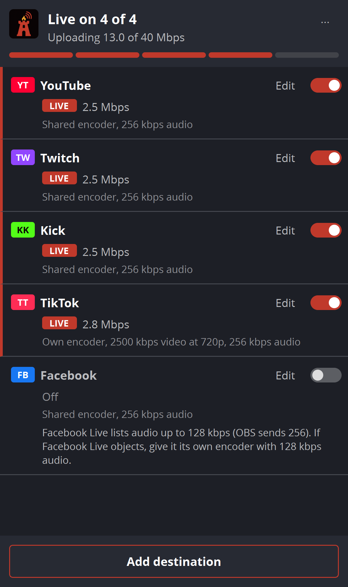

# Red Warden Multistream

**Stream to YouTube, Twitch, Kick, TikTok, Facebook, Rumble, X, or any RTMP server at the same time, from OBS Studio's own Start Streaming button.**

A free, open-source OBS Studio plugin by [Red Warden Studios](https://redwardenstudios.com/division/bastion/). Signed, published by a real LLC, and built by a streamer who uses it live.



**Download:** [redwardenstudios.com](https://redwardenstudios.com/division/bastion/) or [Releases](https://github.com/Red-Warden-Studios/red-warden-multistream/releases).

## What it does

- **One button.** Switch a destination on and it starts when you press Start Streaming in OBS, and stops when you stop. No second app, no second Go Live.
- **Share OBS's encoder, or give a platform its own.** Shared adds no extra encoding: OBS encodes once and every platform gets it. A separate encoder lets one platform get a different bitrate, resolution or encoder; its audio starts out matching OBS's bitrate and track.
- **Know if your connection can carry it.** The dock shows total upload against your connection (measure it with a built-in speed test while offline, or type it in) and warns before you run out of headroom.
- **Platform advice from OBS's own data.** Bitrate, resolution and keyframe limits come from the service list OBS ships. Nothing is guessed.
- **Protects your accounts.** Every destination has a connection budget (at most 12 attempts in any 10 minutes, 40 in an hour, counting every attempt the plugin makes), so it can't hammer a platform's servers. A dropped connection reconnects quickly (roughly 5 s, 10 s, 20 s, 40 s, then every minute, jittered and always inside the budget). A rejected stream key or a broken server URL is never retried automatically: the card tells you to fix it.
- **Notices a stuck connection.** An output that stays connected but stops sending data is restarted.
- **End-of-stream report.** How long each platform was live, every drop and recovery, how much was sent. The last 50 are saved, and copyable.
- **Moving from another plugin?** Imports your destinations from obs-multi-rtmp and Aitum Multistream, with the settings it can read.
- **Test Twitch without going live.** Uses Twitch's bandwidth-test mode.
- **Hotkeys, Stream Deck, automation.** A hotkey per destination plus all-on and all-off (bind them to Stream Deck keys), and an obs-websocket API for Streamer.bot, Touch Portal, SAMMI and scripts.
- **Stream keys stay secret.** Keys live in Windows Credential Manager, never in a config file, and the plugin refuses a server URL that contains your key (OBS writes server URLs to its log).
- **Update notice.** Once per OBS start it checks for a newer version and shows a one-line notice. It never downloads anything on its own, and it can be switched off.

## Requirements

- Windows 10 or 11, 64-bit
- OBS Studio 31.1 or newer

## Install

Close OBS, run `red-warden-multistream-<version>-windows-x64-setup.exe`, then open **Docks > Red Warden Multistream**.

To upgrade, run the newer installer the same way: it replaces the plugin in place and keeps your destinations and keys. To remove it: **Settings > Apps > Installed apps > Red Warden Multistream (OBS plugin)**; your destinations and keys stay, in case you reinstall. (Removing a destination in the dock deletes its saved key.)

Prefer no installer? Copy the `rws-multistream` folder from the zip into `C:\ProgramData\obs-studio\plugins\`.

## Privacy

No telemetry, no account. The plugin only connects to:

- the streaming servers you add;
- `speed.cloudflare.com`, only when you run the upload test (throwaway test data);
- `redwardenstudios.com/updates/stream-kit.json`, once per OBS start, to look for an update (a plain request whose User-Agent names the plugin version). Turn it off in the dock's **...** menu.

## obs-websocket API

Vendor name `RedWardenMultistream`, through obs-websocket's `CallVendorRequest`:

| requestType | requestData | |
|---|---|---|
| `GetDestinations` | none | Lists destinations with `id`, `name`, `platform`, `enabled`, `state`, `kbps` |
| `SetDestination` | `{ "destination": "<id or name>", "enabled": true }` | Switches one on or off |
| `ToggleDestination` | `{ "destination": "<id or name>" }` | Flips one |
| `SetAllDestinations` | `{ "enabled": true }` | Switches all |

Every state change emits a `DestinationChanged` vendor event.

## Building from source

Windows, Visual Studio 2022, CMake 3.30 or newer.

```
cmake --preset windows-x64
cmake --build build_x64 --config RelWithDebInfo
```

`tools\run-all.ps1` builds and runs the unit tests and the integration harnesses, which drive a portable OBS copy against local ffmpeg receivers (they never touch a real platform or your own OBS). `tools\package.ps1` builds the installer and zip.

## License

GPL-2.0-or-later. See [LICENSE](LICENSE).

"Red Warden", "Red Warden Studios", "Red Warden Multistream" and the Red Warden logos are trademarks of Red Warden Studios LLC and are not licensed by the GPL. If you distribute a modified version, please give it a different name and remove the logos. See [NOTICE.txt](NOTICE.txt). OBS Studio is a trademark of its respective owners; this plugin is not made or endorsed by the OBS Project.
